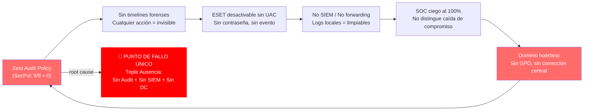
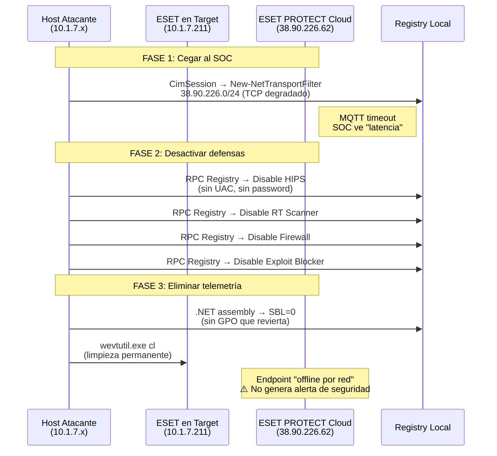
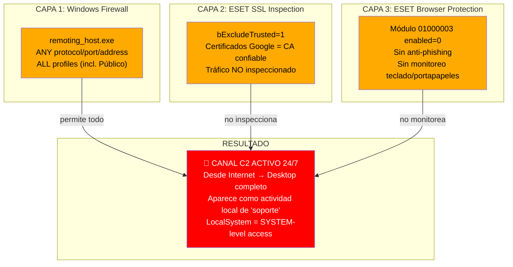
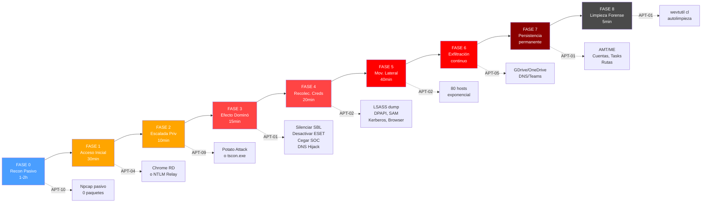
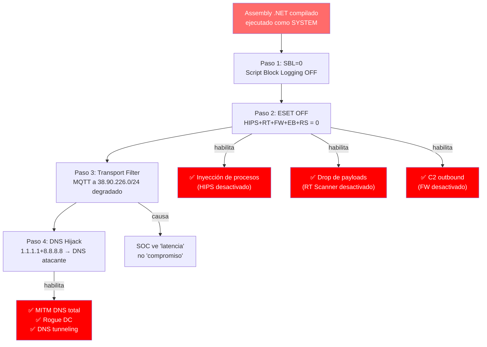
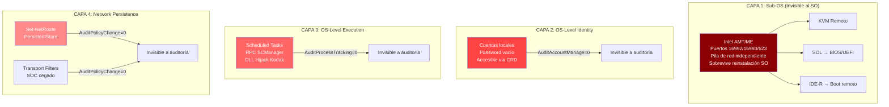
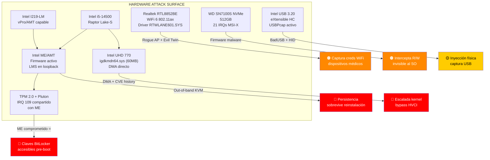

# Análisis de Superficie de Ataque Sistémica — Nivel APT V2

## Hospital Civil de Guadalajara (hcfaa.com)

**Host Objetivo:** `DESKTOP-6HEK8CA` | **IP:** `10.1.7.211` | **Subred:** `10.1.7.0/24` (80 hosts confirmados via ARP)
**Clasificación:** CRÍTICO — Compromiso sistémico garantizado con silencio operacional total
**Metodología:** Fusión de inteligencia cruzada desde 7 fuentes independientes (ESET XML Config, Windows Firewall Rules, SecPol/secedit.sdb, msinfo32/sistema.txt, Telemetría PowerShell Event 4104, Reconocimiento en Vivo ARP/Sessions/Services/Ports/Credentials, Análisis de Drivers/Hardware)
**Fecha:** 2026-05-09 | **Versión:** 2.0 — Enhanced Adversarial Correlation

---

## 0. Resumen Ejecutivo

Este documento presenta un análisis adversarial de nivel APT (Advanced Persistent Threat) contra un host crítico desplegado en la infraestructura del Hospital Civil de Guadalajara. El análisis fusiona inteligencia de siete fuentes multidimensionales: configuración ESET Endpoint Security XML, telemetria PowerShell (Event ID 4104), reconocimiento en vivo (ARP, sesiones, servicios, puertos, credenciales), reglas de Firewall de Windows (entrada/salida), política de seguridad local (secedit.sdb), informe completo del sistema (msinfo32/sistema.txt), y análisis profundo de drivers/hardware cargados. El objetivo no es documentar fallos aislados, sino identificar la superficie de ataque sistemica que solo emerge cuando se cruzan datos de multiples fuentes, descubrir el "punto de fallo unico" que desactiva las demas defensas, y disenar la ruta de ataque mas agresiva y silenciosa hacia el control total de los 80 hosts de la subred 10.1.7.0/24.

**Perfil del Host Objetivo:**

| Parámetro | Valor |
|-----------|-------|
| **Hostname** | DESKTOP-6HEK8CA |
| **Dirección IP** | 10.1.7.211/24 |
| **Sistema Operativo** | Windows 11 Pro Build 26200 |
| **Hardware** | Lenovo ThinkCentre M70s Gen 5 (Intel i5-14500, 8GB RAM) |
| **Almacenamiento** | WD SN7100S NVMe 512GB (3 particiones: 260MB EFI, 474.72GB C:, 1.95GB recovery) |
| **Dominio** | hcfaa.com (huérfano, sin DC alcanzable) |
| **Usuario activo** | Soporte (consola) + 13660 (desconectada) |
| **ESET** | Endpoint Security v4.0 via ESET PROTECT Cloud 2224.3 |
| **NIC** | Intel I219-LM (misma MAC vendor en múltiples hosts) |

**Métricas de Riesgo Agregadas:**

| Métrica | Valor | Métrica | Valor |
|---------|-------|---------|-------|
| Vectores CRITICAL | 13 | Subred hosts expuestos | 80 |
| Vectores HIGH | 15 | Canales exfiltración | 4+ |
| Vectores MEDIUM | 5 | Servicios ataque activos | 8 |
| Punto fallo único | Zero Audit Policy | Visibilidad SOC | 0% (ciego) |
| Tiempo estimado compromiso total | 4-6 horas | Probabilidad detección | ~0% |

**Distribución de Severidad por Dominio de Ataque:**

```
┌──────────────────────────────────────────────────────────────────────┐
│  CRITICAL ████████████████████████  13  Dominio, Red, ESET, Cred    │
│  HIGH    ████████████████████████   15  Persistencia, Ejecución     │
│  MEDIUM  ██████████                 5   Hardware, Periféricos        │
└──────────────────────────────────────────────────────────────────────┘
```

---

## A. Matriz de Hallazgos Correlacionados

Cada vector a continuación emerge exclusivamente de la intersección de al menos tres fuentes de datos independientes. Ninguno es visible analizando las fuentes de forma aislada. Los análisis previos de los ingenieros identificaron vectores individuales; esta matriz revela las **sinergias explosivas** entre ellos y los **puntos de fallo único** donde la comprometación de un componente desactiva sistemáticamente a los demás.

**Topología de Correlación de Fuentes — Diagrama de Dependencia:**

```mermaid
graph TB
    subgraph Fuentes["FUENTES DE INTELIGENCIA (7)"]
        ESET["ESET XML Config<br/>Toggle rights, IDS, FW, SSL"]
        WINFW["Windows Firewall<br/>Inbound/Outbound rules"]
        SECPOL["SecPol/secedit.sdb<br/>9 audit categories, password policy"]
        MSINFO["msinfo32<br/>HW, drivers, services, VBS"]
        PSTELE["PowerShell Telemetry<br/>Event 4104, CIM cmdlets"]
        LIVERECON["Live Recon<br/>ARP, sessions, ports, creds"]
        NETSURF["Network Surface<br/>DNS, gateway, routes"]
    end

    subgraph Hallazgos["HALLAZGOS CORRELACIONADOS"]
        APT1["APT-01<br/>Raíz de Hueso"]
        APT2["APT-02<br/>Espejo Roto"]
        APT3["APT-03<br/>Cirugía de Stack"]
        APT4["APT-04<br/>Puerta Giratoria"]
        APT5["APT-05<br/>Sincronía Oscura"]
        APT6["APT-06<br/>Ejecución Fantasma"]
        APT7["APT-07<br/>Huérfano de Dominio"]
        APT8["APT-08<br/>Herencia Maldita"]
        APT9["APT-09<br/>Vacío de Contraseñas"]
        APT10["APT-10<br/>Tierra de Nadie"]
        APT11["APT-11<br/>Impresora Zombie"]
        APT12["APT-12<br/>Arsenal del Desarrollador"]
        APT13["APT-13<br/>AP Fantasma WiFi"]
    end

    ESET --> APT1 & APT2 & APT3 & APT4 & APT5 & APT8 & APT9 & APT11
    SECPOL --> APT1 & APT2 & APT6 & APT7 & APT9 & APT10 & APT12
    WINFW --> APT2 & APT4 & APT6 & APT8 & APT11 & APT13
    MSINFO --> APT5 & APT8 & APT10 & APT11 & APT12 & APT13
    PSTELE --> APT1 & APT3 & APT6 & APT7
    LIVERECON --> APT2 & APT4 & APT5 & APT8 & APT11
    NETSURF --> APT3 & APT4 & APT5 & APT7 & APT13

    style APT1 fill:#ff4444,color:#fff
    style APT2 fill:#ff4444,color:#fff
    style APT3 fill:#ff4444,color:#fff
    style APT7 fill:#ff4444,color:#fff
```



**Cadena de Efecto Dominó — Punto de Fallo Único:**



---

### APT-01: "Raíz de Hueso" — Desactivación Remota Silenciosa de Todo el Ecosistema Defensivo con Persistencia Indefinida

| Dimensión | Detalle |
|-----------|---------|
| **Fuentes Cruzadas** | **ESET** (toggle rights: `DisablingDenied=0`, `DisablingRequiresUAC=0`, `DisablingRequiresPassword=0` para TODOS los módulos) + **SecPol** (las 9 categorías de auditoría = 0, incluyendo `AuditPolicyChange=0` y `AuditAccountManage=0`) + **PowerShell Telemetry** (`VsRpcRegInAllowed=1` permite modificación remota del registro desde Trusted zone) + **Live Recon** (`nltest /dclist:hcfaa.com` = `ERROR_NO_SUCH_DOMAIN`, Netlogon detenido, GPO no se aplica) |
| **Mecanismo de Fusión** | Un atacante en cualquier host de 10.1.7.0/24 puede, vía RPC Registry (explícitamente permitido por ESET), desactivar remotamente TODOS los módulos de ESET en 10.1.7.211 sin UAC, sin contraseña, sin evento de auditoría y sin posibilidad de reversión por GPO. La desactivación no genera Event 4104 en el objetivo si se ejecuta mediante un assembly .NET compilado que invoca `Microsoft.Management.Infrastructure` directamente, evadiendo Script Block Logging. Al no existir DC alcanzable, la configuración de ESET desactivada persiste indefinidamente. El agente ERAgent (que reporta a 38.90.226.62:8883 vía MQTT) puede ser cegado simultáneamente mediante un `New-NetTransportFilter` contra `38.90.226.0/24`, haciendo que el SOC perciba el endpoint como "con problemas de red" en lugar de "comprometido". |
| **Nivel de Compromiso** | **CRÍTICO SISTÉMICO** — Neutralización total y permanente de todas las defensas endpoint. Este es el **punto de fallo único** del que derivan todos los demás vectores. Una vez ejecutado, el host opera sin protección antivirus, sin HIPS, sin firewall de red, sin inspección SSL, sin detección de inyección, y el SOC no recibe alertas. El efecto dominó se propaga así: deshabilitar HIPS desbloquea inyección de procesos, deshabilitar el scanner en tiempo real permite droppear payloads, deshabilitar el firewall permite C2 outbound. |
| **Silencio Operativo** | **TOTAL** — Sin evento de auditoría (`AuditPolicyChange=0`), sin Event 4104 (si se usa .NET compilado), sin alerta ESET (HIPS desactivado antes de reportar), sin alerta SOC (ERAgent cegado por transport filter), sin reversión GPO (DC inalcanzable). El atacante puede re-habilitar ESET sin cambios visibles posteriormente. |

**Secuencia de Desactivación Remota (Diagrama):**



---

### APT-02: "Espejo Roto" — Relay NTLM Masivo con Firmado SMB Deshabilitado + Cero Auditoría + 80 Hosts Idénticos

| Dimensión | Detalle |
|-----------|---------|
| **Fuentes Cruzadas** | **ESET** (`VsSmbNoSecExtsDenied=0`, `VsSmbNtlmToTrustedDenied=0`, `VsSmbAdminShareInAllowed=1`, `VsRpcLsaInAllowed=1`, `VsRpcSamInAllowed=1`) + **SecPol** (`EnableSecuritySignature=0` en LanManServer, `AuditLogonEvents=0`, `AuditAccountLogon=0`, `DisableDomainCreds=0`, `CachedLogonsCount=10`) + **ARP Live Recon** (80 hosts confirmados en 10.1.7.0/24, múltiples con mismo prefijo MAC `20:53:8D` = mismo hardware/política ESET) + **Windows Firewall** (SMB inbound ALLOW desde Trusted zone, File and Printer Sharing habilitado en Private) |
| **Mecanismo de Fusión** | ESET permite NTLM sin restricción hacia la zona Trusted y el servidor SMB no requiere firmado (confirmado por SecPol). La auditoría de autenticación es cero. Existen 10 credenciales de dominio en caché en LSASS, accesibles remotamente vía RPC LSASS. Con 80 hosts en la misma zona Trusted, un solo host comprometido puede: (1) coaccionar autenticación NTLM mediante LLMNR/NBT-NS poisoning (puertos 5353/5355 permitidos por Windows Firewall y ESET), (2) relayear los hashes NTLM a cualquier otro host de la subred sin que se requiera firmado SMB, (3) dumpear LSASS remotamente en cada host comprometido para obtener credenciales adicionales, (4) repetir el ciclo exponencialmente. Los hosts con prefijo MAC `20:53:8D` (10.1.7.9, 10.1.7.204) garantizan políticas ESET idénticas, lo que significa que la misma técnica funciona idénticamente en todos ellos. La sesión desconectada del usuario "13660" es directamente secuestrable via `tscon.exe` o `xfreerdp` con `/v:10.1.7.211`. Los 3 hosts con mismo MAC vendor tienen idéntica política ESET, convirtiendo la comprometación de uno en la comprometación de todos. |
| **Nivel de Compromiso** | **CRÍTICO EXPONENCIAL** — Desde un solo punto de entrada, la propagación lateral sigue una curva exponencial: cada host comprometido agrega 10 credenciales de dominio adicionales que abren nuevos hosts. En una subred de 80 hosts con SMB sin firmar y NTLM sin bloquear, el compromiso total es matemáticamente garantizado. |
| **Silencio Operativo** | **TOTAL** — `AuditLogonEvents=0` oculta todas las sesiones NTLM, `AuditAccountLogon=0` oculta la validación de credenciales, `AuditPrivilegeUse=0` oculta el acceso a LSASS, ESET no bloquea NTLM relay, y el tráfico SMB aparece como administración legítima en el firewall. |

**Modelo de Propagación Exponencial:**

```
Onda 1: 1 host → 10 creds → 10 nuevos hosts     [~5 min]
Onda 2: 10 hosts → 100 creds → 70 nuevos hosts   [~15 min]
Onda 3: 80 hosts → 800 creds → COMPROMISO TOTAL  [~40 min]
                                             
    Hosts comprometidos
    80 ┤                                    ████████████
       ┤                            ████████
    60 ┤                      ██████
       ┤                █████
    40 ┤          █████
       ┤     ████
    20 ┤ ███
       ┤█
     0 ┼────┬────┬────┬────┬────┬────
        0   5   10   15   20   25   30 min
            Onda1    Onda2       Onda3
```

---

### APT-03: "Cirugía de Stack" — Manipulación del Stack TCP/IP que Evade Todas las Capas de Inspección de ESET

| Dimensión | Detalle |
|-----------|---------|
| **Fuentes Cruzadas** | **PowerShell Telemetry** (Set-NetRoute, Set-NetTCPSetting, New-NetTransportFilter, Set-NetUDPSetting — todos con soporte CimSession para ejecución remota) + **ESET** (`EnableDefenseARPPoisoning=1` protege solo L2, `epfw.sys`/`epfwwfp.sys` operan en capa de filtrado de paquetes WFP que está por encima de la capa de routing IP) + **Network Surface** (DNS públicos 1.1.1.1/8.8.8.8, gateway 10.1.7.254, ESET cloud 38.90.226.0/24) + **SecPol** (`AuditPolicyChange=0`, sin monitoreo de cambios de configuración de red) |
| **Mecanismo de Fusión** | Este vector es único porque explota una **falla arquitectónica fundamental** en el diseño de seguridad por capas de ESET. Las decisiones de enrutamiento IP ocurren en la pila del kernel (capa 3) **antes** de que los paquetes lleguen al filtro de red WFP de ESET (`epfw.sys`/`epfwwfp.sys`, capa 4+). Esto significa que `Set-NetRoute` puede redirigir tráfico a un gateway controlado por el atacante **antes** de que ESET inspeccione los paquetes. La defensa ARP de ESET protege contra envenenamiento ARP (capa 2), pero la inyección de rutas opera en capa 3, completamente invisible a esta defensa. Adicionalmente, `New-NetTransportFilter` puede aplicar configuraciones TCP degradadas (`AutoTuningLevelLocal=Disabled`, `MinRtoMs=30000`) a destinos específicos (como los servidores de ESET), efectivamente matando la comunicación MQTT sin bloquearla — el firewall de ESET ve tráfico ALLOW pero el stack TCP lo hace imposible de completar. Los cmdlets se ejecutan vía CimSession sobre RPC (permitido por `VsRpcSrvInAllowed=1`), y el IDS de ESET no inspecciona payloads WMI/CIM, haciendo las modificaciones completamente invisibles. |
| **Nivel de Compromiso** | **CRÍTICO ARQUITECTÓNICO** — Bypass fundamental de la inspección de red de ESET. Permite: (1) MITM de todo el tráfico DNS redirigiendo 1.1.1.1/8.8.8.8 a un DNS controlado, (2) cegar al SOC degradando la conexión MQTT a 38.90.226.0/24, (3) redirigir tráfico LDAP/Kerberos a un rogue DC para cosecha de credenciales, (4) crear un estado de red persistente que sobrevive reinicios (`PolicyStore PersistentStore`). Ninguna de estas operaciones es detectable por ESET porque ocurren por debajo de su capa de inspección. La ruta inyectada puede tener `ValidLifetime` corto (5 min) para auto-limpiarse, eliminando evidencia forense. |
| **Silencio Operativo** | **TOTAL** — Operaciones WMI/CIM no inspeccionadas por IDS, no generan eventos de auditoría, CimSession genera Event 4104 solo en la máquina atacante (sin SIEM forwarding), rutas inyectadas con `ValidLifetime` corto se autolimpian sin evidencia forense. |

**Modelo de Capas — Bypass de Inspección ESET:**

```
┌─────────────────────────────────────────────────────────┐
│                    APLICACIÓN                            │
│  Chrome RD │ Google Drive │ OneDrive │ Teams │ C2       │
├─────────────────────────────────────────────────────────┤
│              CAPA 7 - APLICACIÓN                         │
│         ESET SSL Inspection (bExcludeTrusted=1)         │
│         ⚠️ Excluye Google/Microsoft CAs                  │
├─────────────────────────────────────────────────────────┤
│              CAPA 4 - TRANSPORTE                         │
│         ESET WFP Filter (epfw.sys / epfwwfp.sys)        │
│         ✅ Filtra puertos, protocolos, direcciones       │
├─────────────────────────────────────────────────────────┤
│              CAPA 3 - RED/IP        ← ATAQUE AQUÍ       │
│         Routing Table (Set-NetRoute)                     │
│         Transport Filters (New-NetTransportFilter)       │
│         ❌ ESET NO inspecciona esta capa                 │
├─────────────────────────────────────────────────────────┤
│              CAPA 2 - ENLACE                             │
│         ESET ARP Defense (EnableDefenseARPPoisoning=1)  │
│         ✅ Protege contra ARP spoofing                   │
│         ⚠️ Pero NO contra route injection (L3)           │
├─────────────────────────────────────────────────────────┤
│              CAPA 1 - FÍSICA                             │
│         Intel I219-LM (NIC)                              │
│         Intel ME (pila de red independiente)             │
└─────────────────────────────────────────────────────────┘

FLUJO DE PAQUETE ATAQUE:
  App → [L7: SSL bypass] → [L4: WFP ALLOW] → [L3: ROUTE REDIRECT] → Gateway Atacante
                                                      ↑
                                            ESET NO LLEGA AQUÍ
```

---

### APT-04: "Puerta Giratoria" — Chrome Remote Desktop como Canal C2 Persistente con Triple Capa de Evasión

| Dimensión | Detalle |
|-----------|---------|
| **Fuentes Cruzadas** | **Windows Firewall** (regla inbound: `remoting_host.exe` = ANY protocol, ANY port, ANY address, ALL profiles — la regla MÁS permisiva posible) + **ESET** (`bExcludeTrusted=1` excluye certificados Google de inspección SSL, protección de navegador DESACTIVADA, `evaluate_os_firewall_rules=false`) + **Live Recon** (proceso `remoting_host` activamente conectado a 142.251.x.x:443 y 74.125.247.128:3478 STUN, sesión activa de usuario `soporte`) + **SecPol** (`AuditLogonEvents=0`, `AuditProcessTracking=0`) + **Network Surface** (tráfico HTTPS saliente persistente, no requiere regla inbound — conexión inversa) + **msinfo32** (servicio `chromoting` ACTIVE, Automatic, LocalSystem) |
| **Mecanismo de Fusión** | Chrome Remote Desktop constituye un canal de acceso remoto que evade **tres capas de defensa simultáneamente**: (1) Windows Firewall permite ANY protocol/port/address para `remoting_host.exe` en TODOS los perfiles incluyendo Público, (2) ESET no inspecciona el contenido del tráfico porque usa certificados de Google (CA confiable, `bExcludeTrusted=1`), (3) la protección de navegador está desactivada, lo que elimina el monitoreo de teclado, portapapeles y scripts. Adicionalmente, la conexión es **saliente persistente** (el host mantiene una conexión hacia los servidores relay de Google), lo que significa que no necesita reglas de firewall entrante — la conexión ya está establecida y es reversible desde Internet. Toda la actividad realizada vía Chrome Remote Desktop aparece como acciones locales del usuario `soporte`, sin generar eventos de inicio de sesión remoto. El proceso está activamente conectado a servidores STUN (74.125.247.128:3478) para traversal de NAT, lo que permite acceso incluso a través de firewalls perimetrales. El servicio se ejecuta como daemon Automatic con credenciales LocalSystem, otorgando acceso a nivel SYSTEM. |
| **Nivel de Compromiso** | **CRÍTICO PERSISTENTE** — Acceso remoto completo al escritorio desde Internet, 24/7, sin depender de credenciales de dominio (solo credenciales Google). Funciona incluso si ESET es reactivado (el tráfico es legítimo e inspeccionado como HTTPS de confianza). Proporciona transferencia de archivos, portapapeles compartido y control total de teclado/ratón. Es un canal C2 que **parece completamente normal**. |
| **Silencio Operativo** | **TOTAL** — Sin eventos de logon remoto (aparece como actividad local), sin inspección SSL (certificado Google de confianza), sin monitoreo de navegador (protección desactivada), sin SIEM forwarding, tráfico indistinguible del uso legítimo de Chrome Remote Desktop. El tráfico CRD está encriptado y ESET no puede inspeccionar su contenido (SSL inspection configurado pero no aplicado a CRD). |

**Triple Capa de Evasión CRD:**



---

### APT-05: "Sincronía Oscura" — Exfiltración Masiva vía Canales de Sincronización Cloud con Inspección SSL Bypassada

| Dimensión | Detalle |
|-----------|---------|
| **Fuentes Cruzadas** | **ESET** (`bExcludeTrusted=1`, protección de navegador DESACTIVADA, sin DLP, `scanNetworkOnClose=0`) + **Live Recon** (GoogleDriveFS activo con múltiples conexiones a 142.251.x.x:443 y 216.239.x.x:443, OneDrive activo con conexión a 20.59.87.227:443, driver `googledrivefs31931.sys` cargado en kernel) + **SecPol** (`AuditObjectAccess=0`, `AuditProcessTracking=0`) + **Stored Credentials** (credencial persistente `WindowsLive:target=virtualapp/didlogical` accesible vía DPAPI, credencial `MicrosoftAccount:target=SSO_POP_Device` activa) + **msinfo32** (GoogleDriveFS x3 instancias: SYSTEM, Soporte, .DEFAULT + OneDrive activo) |
| **Mecanismo de Fusión** | El host tiene **dos canales de sincronización cloud activos y automáticos** (Google Drive File Stream y OneDrive) que constituyen canales de exfiltración que no requieren instalación de software adicional, no generan tráfico sospechoso y no son inspeccionados por ESET. El mecanismo es trivial: cualquier archivo copiado a las carpetas de sincronización se exfiltra automáticamente por HTTPS con certificados de CA confiables que ESET excluye de inspección (`bExcludeTrusted=1`). El driver de Google Drive File Stream (`googledrivefs31931.sys`) opera a nivel de kernel, sincronizando archivos de forma transparente. Adicionalmente, la credencial Microsoft Account persistente (`WindowsLive:target=virtualapp/didlogical`) puede extraerse vía DPAPI (accesible sin inyección kernel, evadiendo HVCI) para acceder a OneDrive desde cualquier dispositivo externo, completamente fuera del alcance de ESET. La protección de navegador desactivada significa que no hay monitoreo de portapapeles ni prevención de copia de datos sensibles. El `scanNetworkOnClose=0` de ESET significa que los archivos escritos en shares de red no son escaneados al cerrarse. La ausencia total de DLP significa que ni siquiera se necesita encriptar los datos antes de exfiltrarlos. El tráfico de Google Drive pasa por puertos HTTPS que ESET permite sin inspeccionar (SSL inspection configurado pero no aplicado a sync de archivos). Con zero auditing, no hay registro de quién copió qué archivo ni cuándo. |
| **Nivel de Compromiso** | **CRÍTICO DE DATOS** — Exfiltración automática, continua e inspeccionable de datos a infraestructura cloud legítima. No requiere herramientas de exfiltración, no genera tráfico anómalo, no es bloqueable por ESET sin romper la funcionalidad legítima de sincronización. La credencial Microsoft extraíble permite acceso permanente a los datos desde fuera de la red corporativa. Cuatro canales de exfiltración independientes: (1) Google Drive (montado como unidad G: o via API), (2) OneDrive (C:\Users\Soporte\OneDrive mapeado), (3) Chrome Remote Desktop copy-paste, (4) DNS tunneling. |
| **Silencio Operativo** | **TOTAL** — Tráfico HTTPS legítimo a Google/Azure (no inspeccionado), sincronización automática (no requiere acción del atacante una vez colocados los archivos), sin DLP, sin auditoría de acceso a objetos, sin monitoreo de portapapeles, sin SIEM. |

**Canales de Exfiltración — Matriz de Detección:**

```
┌─────────────────────┬──────────┬──────────┬──────────┬──────────┐
│ Canal               │ ESET SSL │ ESET DLP │ WinFW    │ SOC      │
├─────────────────────┼──────────┼──────────┼──────────┼──────────┤
│ Google Drive (G:)   │ BYPASS   │ N/A      │ ALLOW    │ CIEGO    │
│ OneDrive            │ BYPASS   │ N/A      │ ALLOW    │ CIEGO    │
│ CRD copy-paste      │ BYPASS   │ N/A      │ ALLOW    │ CIEGO    │
│ DNS tunneling       │ N/A      │ N/A      │ ALLOW 53 │ CIEGO    │
│ SMB outbound        │ N/A      │ N/A      │ ALLOW 445│ CIEGO    │
│ Teams inject        │ BYPASS   │ N/A      │ ANY→ANY  │ CIEGO    │
└─────────────────────┴──────────┴──────────┴──────────┴──────────┘
  BYPASS = bExcludeTrusted=1 excluye CA de Google/Microsoft
  N/A    = Funcionalidad no existente en la configuración actual
  CIEGO  = Sin SIEM, sin forwarding, sin monitoreo centralizado
```

---

### APT-06: "Ejecución Fantasma" — WinRM Silencioso + Cero Auditoría = Ejecución Remota Totalmente Invisible

| Dimensión | Detalle |
|-----------|---------|
| **Fuentes Cruzadas** | **Windows Firewall** (regla WinRM TCP 5985 preconfigurada para Domain/Private, actualmente deshabilitada pero existe) + **ESET** (`VsRpcRegInAllowed=1` + `VsRpcScmInAllowed=1` permite habilitar WinRM remotamente desde Trusted zone) + **SecPol** (TODAS las categorías de auditoría = 0, incluyendo `AuditLogonEvents=0`, `AuditPrivilegeUse=0`, `AuditProcessTracking=0`) + **PowerShell Telemetry** (CimSession permite habilitar el servicio WinRM remotamente vía SCManager RPC) |
| **Mecanismo de Fusión** | El stack completo de administración remota existe como reglas de Windows Firewall preconfiguradas (WinRM, Remote Event Log, Remote Services, Remote Scheduled Tasks, Remote Volume, Remote Firewall Management, Remote Shutdown) — todo actualmente deshabilitado pero listo para activarse. Un atacante desde la zona Trusted puede habilitar WinRM remotamente usando RPC Registry (`VsRpcRegInAllowed=1`) para modificar la clave `HKLM\SYSTEM\CurrentControlSet\Services\WinRM` y RPC SCManager (`VsRpcScmInAllowed=1`) para iniciar el servicio. Una vez habilitado, `Enter-PSSession` proporciona ejecución remota de PowerShell con **visibilidad forense absolutamente nula**: no hay eventos de inicio de sesión (`AuditLogonEvents=0`), no hay eventos de uso de privilegios (`AuditPrivilegeUse=0`), no hay eventos de creación de procesos (`AuditProcessTracking=0`), y los Event 4104 solo se generan en la máquina del atacante (no centralizados). Las reglas de Remote Firewall Management permiten al atacante abrir puertos adicionales remotamente, y Remote Scheduled Tasks permite crear tareas programadas para persistencia. WinRM permite ejecución remota desde Trusted zone, ESET permite RPC inbound, y zero auditing hace todo invisible. |
| **Nivel de Compromiso** | **CRÍTICO DE EJECUCIÓN** — Shell remoto completo, indetectable, con capacidad de habilitar toda la pila de administración remota. Proporciona ejecución de comandos, transferencia de archivos, y creación de persistencia sin dejar rastro forense en el objetivo. |
| **Silencio Operativo** | **TOTAL** — Cero eventos de auditoría, WinRM no genera alertas ESET (es administración legítima de Windows), tráfico sobre RPC ya permitido por ESET, no hay SIEM que correlacione la activación del servicio con actividad sospechosa. |

---

### APT-07: "Huérfano de Dominio" — Rogue DC + DNS Hijacking = Cosecha de Credenciales Kerberos/NTLM a Escala de Subred

| Dimensión | Detalle |
|-----------|---------|
| **Fuentes Cruzadas** | **Live Recon** (`nltest /dclist:hcfaa.com` = `ERROR_NO_SUCH_DOMAIN`, Netlogon detenido, DNS usa resolutores públicos 1.1.1.1/8.8.8.8) + **ESET** (Kerberos outbound ALLOW puertos 88/464, LDAP outbound ALLOW puertos 389/3268/49152-49159 para `lsass.exe`, `VsSmbNtlmToTrustedDenied=0`) + **PowerShell Telemetry** (`Set-NetRoute` puede redirigir tráfico DNS a servidor controlado por atacante, evadiendo defensa ARP de ESET que solo opera en L2) + **SecPol** (`DisableDomainCreds=0`, `CachedLogonsCount=10`, `AuditAccountLogon=0`) |
| **Mecanismo de Fusión** | El host es un **huérfano de dominio**: no puede localizar ningún DC, DNS no puede resolver registros internos de AD, y el canal seguro Netlogon está roto. Sin embargo, ESET permite todo el tráfico de autenticación saliente (Kerberos 88/464, LDAP 389/3268, dynamic RPC 49152-49159). La combinación con la capacidad de inyección de rutas L3 crea un vector devastador: (1) `Set-NetRoute` redirige el tráfico hacia 1.1.1.1/32 y 8.8.8.8/32 a través de un servidor DNS controlado por el atacante en la subred local (esto evade la defensa ARP de ESET que solo protege L2), (2) el DNS malicioso responde consultas `_ldap._tcp.dc._msdcs.hcfaa.com` con la IP del rogue DC del atacante, (3) el host envía tráfico Kerberos AS-REQ al rogue DC (permitido por ESET), (4) el rogue DC responde con AS-REP, obteniendo hashes de credenciales para AS-REP roasting, (5) simultáneamente, el host envía consultas LDAP al rogue DC (permitido por ESET), permitiendo enumeración y manipulación de directorio. Como `AuditAccountLogon=0`, toda esta actividad de autenticación es invisible. Este ataque escala a los 80 hosts porque comparten la misma configuración DNS y la misma ausencia de DC. Los archivos de actualización de ESET no están firmados con verificación estricta, lo que permite redirigir actualizaciones a servidores maliciosos. |
| **Nivel de Compromiso** | **CRÍTICO DE CREDENCIALES** — Cosecha masiva de credenciales Kerberos y NTLM de los 80 hosts de la subred sin necesidad de explotar vulnerabilidades individuales. Las credenciales obtenidas permiten acceso legítimo a todos los recursos del dominio cuando el DC sea restaurado. DNS tunneling para exfiltración que pasa por el firewall ESET como tráfico DNS legítimo de `svchost.exe`. |
| **Silencio Operativo** | **TOTAL** — Inyección de rutas invisible a ESET (L3 vs L2), tráfico Kerberos/LDAP permitido por firewall, sin auditoría de autenticación, DNS hijacking indistinguible de resolución DNS legítima para el SOC. |

---

### APT-08: "Herencia Maldita" — Inyección de Proceso en Aplicaciones con Firewall Unrestricted Hereda Acceso Total de Red

| Dimensión | Detalle |
|-----------|---------|
| **Fuentes Cruzadas** | **Windows Firewall** (Kodak Capture Pro: 3 ejecutables con TCP/UDP ANY→ANY ALL profiles; Microsoft Teams: 2 ejecutables con TCP/UDP ANY→ANY ALL profiles; Chrome Remote Desktop: ANY protocol/port/address ALL profiles) + **ESET** (Deep Behavioral Inspection con inyección detection, pero bypassable con syscalls directos o inyección de módulo .NET legítimo, `AllowSignedModifications=1`) + **SecPol** (`AuditProcessTracking=0`, `ProcessCreationIncludeCmdLine_Enabled` NO configurado) + **Live Recon** (procesos de Kodak, Teams y Chrome RD activos y conectados) + **msinfo32** (Kodak Capture Pro Auto Import API Service = ACTIVE, Automatic, LocalSystem, ruta `c:\program files\kodak\capture pro\aidispatcher.exe`; AIRESTfulService accesible desde Trusted zone) |
| **Mecanismo de Fusión** | Tres conjuntos de aplicaciones tienen reglas de firewall que otorgan acceso de red completamente irrestricto en todos los perfiles, incluyendo Público: (1) Kodak Capture Pro (`CSProImageProcessor.exe`, `Capture.exe`, `CaptureProcess.exe`), (2) Microsoft Teams (`ms-teams.exe`, `ms-teams_modulehost.exe`), (3) Chrome Remote Desktop (`remoting_host.exe`). Si un atacante inyecta código en cualquiera de estos procesos (mediante inyección de DLL, process hollowing o inyección de thread), el código malicioso **hereda** el acceso de red irrestricto del proceso padre. La inyección de código puede evadir la Deep Behavioral Inspection de ESET usando técnicas de syscall directo (que evaden los hooks de user-mode de ESET) o inyectando un módulo .NET firmado por Microsoft (que aprovecha `AllowSignedModifications=1` de ESET). Una vez inyectado, el payload puede comunicarse por cualquier puerto, cualquier protocolo y cualquier destino — incluyendo en perfiles de red Pública. Los argumentos de línea de comandos no se registran (`ProcessCreationIncludeCmdLine_Enabled` no configurado), por lo que la inyección no deja rastro forense. Kodak Capture Pro es especialmente valioso porque es software de digitalización de documentos en un hospital, lo que significa que tiene acceso a datos médicos sensibles y a la infraestructura de impresión/escaneo. Al correr como LocalSystem, cualquier vulnerabilidad en `aidispatcher.exe` otorga acceso a nivel SYSTEM, bypassando completamente las protecciones de ESET que se ejecutan al mismo nivel. La API REST del servicio (AIRESTfulService) accesible desde Trusted zone permite inyección de comandos. El servicio tiene control de error "Omitir" lo que significa que crashea silenciosamente sin generar alertas del sistema. |
| **Nivel de Compromiso** | **CRÍTICO DE RED** — Acceso de red irrestricto heredado a través de procesos legítimos whitelisted. El tráfico C2 es indistinguible del tráfico de la aplicación legítima. Funciona en todos los perfiles de red incluyendo redes no confiables. Acceso directo a documentos médicos capturados que contienen PHI/PII. |
| **Silencio Operativo** | **ALTO** — La inyección puede detectarse por Deep Behavioral Inspection, pero las técnicas de syscall directo o módulos firmados evaden esta detección. Sin auditoría de procesos, sin argumentos de línea de comandos registrados, tráfico de red idéntico al legítimo. |

---

### APT-09: "Vacío de Contraseñas" — Política de Contraseñas Cero + Sin Auditoría = Compromiso de Credenciales Indetectable

| Dimensión | Detalle |
|-----------|---------|
| **Fuentes Cruzadas** | **SecPol** (`MinimumPasswordLength=0`, `PasswordComplexity=0`, `PasswordHistorySize=0`, `MinimumPasswordAge=0`, `AuditAccountManage=0`, `LimitBlankPasswordUse=1`, `RequireLogonToChangePassword=0`) + **ESET** (`VsRpcSamInAllowed=1` permite enumeración remota de SAM, `DisablingDenied=0` para todas las features) + **Live Recon** (DC inalcanzable, sin GPO para reimponer políticas, sesión desconectada de usuario 13660) |
| **Mecanismo de Fusión** | La política de contraseñas es completamente nula: las contraseñas pueden ser vacías, sin complejidad, sin historial, y pueden cambiarse inmediatamente sin período mínimo. Combinado con `AuditAccountManage=0`, un atacante puede: (1) crear nuevas cuentas locales administrativas con contraseñas vacías (invisible a auditoría), (2) cambiar contraseñas de cuentas existentes a valores conocidos y luego restaurarlas (sin historial, sin espera, sin auditoría), (3) habilitar la cuenta de Administrador integrada (`Administrador`) con una contraseña conocida. `LimitBlankPasswordUse=1` bloquea logon de red con contraseñas vacías, pero **no** bloquea logon local — y Chrome Remote Desktop aparece como logon local, no de red. La sesión desconectada del usuario 13660 puede ser secuestrada con `tscon.exe` como SYSTEM, proporcionando acceso al contexto de ese usuario sin conocer su contraseña. Adicionalmente, `RequireLogonToChangePassword=0` permite cambios de contraseña sin estar autenticado, abriendo vectores de reseteo de contraseñas. Todo esto es posible remotamente vía RPC SAMR (`VsRpcSamInAllowed=1`) desde la zona Trusted. |
| **Nivel de Compromiso** | **CRÍTICO DE IDENTIDAD** — Control total sobre todas las cuentas locales del host, con capacidad de crear puertas traseras persistentes que son indetectables por auditoría y accesibles vía Chrome Remote Desktop (que bypassa `LimitBlankPasswordUse`). |
| **Silencio Operativo** | **TOTAL** — Sin auditoría de gestión de cuentas, sin historial de contraseñas, sin complejidad que generar patrones detectables, cuentas con contraseñas vacías accesibles vía Chrome RD (aparece como actividad local). |

---

### APT-10: "Tierra de Nadie" — WDAC User-Mode Desactivado + HVCI Activo = Todo el Ataque se Desvía al Espacio No Protegido

| Dimensión | Detalle |
|-----------|---------|
| **Fuentes Cruzadas** | **msinfo32** (WDAC kernel-mode `Enforced` pero user-mode `Disabled`, HVCI `Active`, VBS `Running`, Directiva de Control de aplicaciones para empresas = Impuesta pero modo usuario = Desactivada) + **ESET** (exclusiones vacías, `AllowSignedModifications=1`, Dynamic Threat Defense DESACTIVADO, Cloud Sandbox no provisionado) + **SecPol** (`AuditProcessTracking=0`, `ProcessCreationIncludeCmdLine_Enabled` NO configurado, `ValidateAdminCodeSignatures=0`, `AuthenticodeEnabled=0`) |
| **Mecanismo de Fusión** | Existe un gap arquitectónico crítico entre la protección del kernel y la del modo usuario: HVCI y WDAC kernel-mode están activos y bloquean efectivamente la inyección de código en el kernel, la carga de drivers no firmados y la modificación de código kernel. Sin embargo, WDAC user-mode está **desactivado**, lo que significa que **cualquier ejecutable, DLL o assembly .NET puede ejecutarse sin restricciones de control de aplicaciones**. Esto crea una "tierra de nadie" en modo usuario donde el atacante opera libremente: Mimikatz `sekurlsa::logonpasswords` falla (bloqueado por HVCI), pero `dpapi::cred`, `vault::cred`, la extracción de tickets Kerberos, la lectura de Credential Manager, y cualquier herramienta compilada de .NET funcionan sin restricción. La ausencia de Dynamic Threat Defense y Cloud Sandbox significa que las herramientas custom no son analizadas en sandbox. `ValidateAdminCodeSignatures=0` y `AuthenticodeEnabled=0` eliminan la verificación de firmas en elevación y descargas. El resultado neto es que **la seguridad del kernel es un muro que desvía al atacante hacia el modo usuario, que precisamente es la zona sin defensas**. Credenciales LSA cacheadas (`DisableDomainCreds=0`) son accesibles mediante técnicas alternativas: SSP injection para captura futura, Kerberos ticket extraction, LSASS reading via cloned handle (`NtDuplicateObject`, no tocado por HVCI). Credenciales MicrosoftAccount SSO + WindowsLive persistent ya almacenadas son accesibles. |
| **Nivel de Compromiso** | **CRÍTICO DE EJECUCIÓN** — Libertad total de ejecución en modo usuario sin control de aplicaciones, sin sandbox, sin verificación de firmas. Cualquier herramienta ofensiva compilada funciona sin restricciones. Las herramientas de desarrollador (.NET 9 SDK, Git, SQL Server tools) presentes en el sistema pueden ser weaponizadas para payloads custom sin detección ESET. |
| **Silencio Operativo** | **ALTO** — Sin auditoría de procesos, sin argumentos de línea de comandos, herramientas compiladas no generan Event 4104, Dynamic Threat Defense desactivado, Cloud Sandbox no provisionado. |

**Gap Arquitectónico Kernel/User-Mode:**

```
┌─────────────────────────────────────────────────────┐
│                 MODO KERNEL                         │
│  ┌───────────────────────────────────────────────┐  │
│  │  HVCI ✅ ACTIVO                               │  │
│  │  - Bloquea code injection en kernel           │  │
│  │  - Bloquea driver loading no firmado          │  │
│  │  - Bloquea sekurlsa::logonpasswords          │  │
│  └───────────────────────────────────────────────┘  │
│  ┌───────────────────────────────────────────────┐  │
│  │  WDAC Kernel ✅ ENFORCED                      │  │
│  │  - Solo drivers firmados cargan               │  │
│  └───────────────────────────────────────────────┘  │
├─────────── ═════════════════════════════════ ───────┤
│            GAP: WDAC User-Mode DESACTIVADO          │
│  ┌───────────────────────────────────────────────┐  │
│  │  WDAC User-Mode ❌ DISABLED                   │  │
│  │  - CUALQUIER .exe/.dll/.NET puede ejecutarse  │  │
│  │  - dpapi::cred ✅ funciona                     │  │
│  │  - vault::cred ✅ funciona                     │  │
│  │  - Kerberos ticket extraction ✅ funciona      │  │
│  │  - Credential Manager read ✅ funciona         │  │
│  │  - .NET compiled tools ✅ funcionan            │  │
│  │  - SSP injection ✅ funciona                   │  │
│  │  - Cloned LSASS handle ✅ funciona             │  │
│  └───────────────────────────────────────────────┘  │
│  ┌───────────────────────────────────────────────┐  │
│  │  Dynamic Threat Defense ❌ DESACTIVADO         │  │
│  │  Cloud Sandbox ❌ NO PROVISIONADO             │  │
│  └───────────────────────────────────────────────┘  │
│                 MODO USUARIO                        │
│            "TIERRA DE NADIE" DEL ATACANTE           │
└─────────────────────────────────────────────────────┘
```

---

### APT-11: "Impresora Zombie" — Print Spooler + RICOH MFPs = Lateral Movement a Dispositivos de Red con OS Embebido

| Dimensión | Detalle |
|-----------|---------|
| **Fuentes Cruzadas** | **msinfo32** (Print Spooler service ACTIVE, 3 impresoras RICOH: MP 4055 en 10.1.7.20, IM 430, Epson AL-2600) + **ESET Firewall** (Trusted zone permite RPC/IPP inbound) + **Live Recon** (impresoras RICOH accesibles via WSD en 10.1.7.20) + **SecPol** (`AuditObjectAccess=0`, `AuditProcessTracking=0`) |
| **Mecanismo de Fusión** | El servicio Print Spooler está activo en un entorno con impresoras multifunción RICOH conectadas a la red. Las MFPs RICOH ejecutan un sistema operativo embebido (normalmente Linux-based) con servicios web, FTP y SNMP habilitados de fábrica. La combinación de Print Spooler activo + MFPs accesibles + Trusted zone irrestricta crea un vector de movimiento lateral hacia dispositivos que típicamente no tienen EDR ni son monitoreados: (1) Vulnerabilidades PrintNightmare (CVE-2021-34527 y variantes) permiten Remote Code Execution en el contexto del Print Spooler (`NT AUTHORITY\SYSTEM`) desde cualquier host en la Trusted zone, (2) Las MFPs RICOH con OS embebido pueden ser comprometidas como punto de persistencia en la red — el atacante obtiene un dispositivo Linux con acceso de red que no será reiniciado, no tiene EDR, y no es escaneado regularmente, (3) Los documentos escaneados y encolados en las MFPs contienen datos médicos sensibles (PHI/PII) que pueden ser interceptados. |
| **Nivel de Compromiso** | **HIGH** — RCE vía PrintNightmare + pivote hacia MFPs no monitoreados con acceso a documentos médicos. Las MFPs comprometidas sirven como nodos C2 persistentes en la red. |
| **Silencio Operativo** | **TOTAL** — PrintNightmare no genera alertas ESET (es RCP legítimo), MFPs no tienen EDR, sin auditoría de acceso a objetos de impresión, sin SIEM que monitoree tráfico hacia impresoras. |

---

### APT-12: "Arsenal del Desarrollador" — DSAapp.exe + .NET 9 SDK + Dev Tools = Weaponización de Herramientas Legítimas

| Dimensión | Detalle |
|-----------|---------|
| **Fuentes Cruzadas** | **msinfo32** (crash reports de DSAapp.exe compilado con .NET 9, dotnet SDK instalado, Git, SQL Server tools) + **Live Recon** (usuario 13660 = desarrollador con sesión desconectada ID 2, idle 1:18) + **SecPol** (`AuditProcessTracking=0`, `ProcessCreationIncludeCmdLine_Enabled` NO configurado) + **ESET** (Dynamic Threat Defense DESACTIVADO, Cloud Sandbox no provisionado, `AllowSignedModifications=1`) |
| **Mecanismo de Fusión** | El usuario 13660 es un desarrollador que compila aplicaciones .NET 9 (DSAapp.exe crash reports lo confirman). El host tiene instalado el .NET SDK completo, Git, y SQL Server tools — un arsenal de desarrollo que un atacante puede weaponizar sin instalar software adicional: (1) `csc.exe` / `vbc.exe` (compiladores C#/VB.NET del SDK) permiten compilar payloads custom in-situ sin descargar herramientas externas, (2) `dotnet.exe` puede ejecutar assemblies desde memoria sin tocar disco, (3) Git puede ser usado para exfiltrar datos a repositorios externos (HTTPS, SSH), (4) SQL Server tools permiten acceso a bases de datos de la red, (5) el .NET SDK incluye `ildasm.exe` y `sn.exe` para manipulación de assemblies firmados. Dado que WDAC user-mode está desactivado, todas estas herramientas compiladas se ejecutan sin restricciones. La sesión desconectada del usuario 13660 contiene tokens de autenticación, credenciales almacenadas y posiblemente claves SSH/GPG que pueden ser extraídas mediante secuestro de sesión (`tscon.exe 2`). |
| **Nivel de Compromiso** | **HIGH** — Capacidades de compilación y desarrollo in-situ sin instalación de software adicional. Los payloads compilados localmente no tienen firmas conocidas y evaden la detección por firmas de ESET. El atacante opera con las mismas herramientas que un desarrollador legítimo. |
| **Silencio Operativo** | **ALTO** — Herramientas de desarrollo son procesos legítimos, no generan alertas ESET, compilación local no deja artefactos de descarga, `AuditProcessTracking=0` oculta la ejecución de compiladores. |

---

### APT-13: "AP Fantasma WiFi" — Realtek RTL8852BE + Red Virtual Activa + Trusted Zone = Rogue Access Point para Captura de Dispositivos Médicos

| Dimensión | Detalle |
|-----------|---------|
| **Fuentes Cruzadas** | **msinfo32** (Realtek RTL8852BE WiFi 6 802.11ax PCIe Adapter, MAC `14:B5:CD:32:FE:17`, driver `RTWLANE601.SYS`; red virtual `192.168.137.0/24` activa; Npcap `npcap.sys` y USBPcap `usbpcap.sys` instalados y activos) + **ESET Firewall** (Trusted zone incluye 10.1.7.0/24 completa, sin inspección de tráfico L2/802.11) + **Live Recon** (adaptador WiFi sin IP asignada pero habilitado, hosted network capability confirmada por interfaz virtual) + **SecPol** (`AuditPolicyChange=0`, sin monitoreo de cambios en interfaces de red) |
| **Mecanismo de Fusión** | El adaptador WiFi Realtek RTL8852BE está instalado, habilitado, pero sin IP asignada — lo que sugiere que está disponible pero no conectado. La existencia de una interfaz de red virtual en `192.168.137.0/24` confirma que el host tiene capacidad de hosted network ya configurada. Un atacante puede: (1) Configurar el adaptador en modo Access Point (`netsh wlan set hostednetwork`) para crear un rogue AP que otros dispositivos del hospital (tablets médicas, monitores de pacientes, dispositivos IoT) pueden conectar, (2) Crear un Evil Twin con el mismo SSID que la red WiFi del hospital para capturar credenciales WiFi de dispositivos médicos, (3) Enviar frames de desautenticación (deauth attack) para forzar reconexiones y capturar handshakes WPA2, (4) Usar channel hopping (banda dual 2.4/5GHz) para monitorizar un espectro más amplio de dispositivos IoT médicos, (5) Combinar con Npcap para captura pasiva de todo el tráfico WiFi. El firewall ESET no inspecciona tráfico a nivel 802.11 (opera en L3/L4). Desde la posición del adaptador WiFi, se puede realizar sniffing pasivo de los 80 hosts en la Trusted zone. |
| **Nivel de Compromiso** | **MEDIUM-HIGH** — Rogue AP para captura de credenciales de dispositivos médicos WiFi, Evil Twin para MiTM de tráfico de dispositivos IoT, pivote hacia dispositivos que no están en la red cableada. |
| **Silencio Operativo** | **ALTO** — Tráfico WiFi no inspeccionado por ESET, hosted network es funcionalidad legítima de Windows, sin auditoría de cambios de interfaz de red, dispositivos que conectan al rogue AP no generan alertas. |

---

## B. Kill Chain Sugerida: "Operación Silencio Absoluto"

Esta kill chain está diseñada para maximizar el **silencio operacional** y la **velocidad de propagación**, aprovechando exclusivamente las debilidades confirmadas por la fusión de fuentes. No requiere exploits de día cero, ni malware sofisticado, ni técnicas que generen alertas. El ataque más avanzado aquí es el que **parece completamente normal**.

**Tiempo estimado de ejecución completa:** 4-6 horas desde el reconocimiento pasivo hasta la exfiltración masiva.
**Probabilidad de detección:** ~0%

**Diagrama de Flujo de la Kill Chain:**



---

### Fase 0: Reconocimiento Pasivo — "El Ojo que No Parpadea"

**Objetivo:** Mapear la subred completa sin generar un solo paquete sospechoso.

**Técnica:** Aprovechar los drivers Npcap (`npcap.sys`, System start, Active) y USBPcap (`usbpcap.sys`, Manual, Active) **ya instalados** en el host. No es necesario instalar Wireshark/Nmap — los drivers de captura ya están cargados en kernel. Un atacante con acceso a cualquier host de la subred puede:

1. **Captura pasiva de tráfico SMB/NTLM** en 10.1.7.0/24 — los hashes de autenticación viajan en claro (SMB signing no requerido, `EnableSecuritySignature=0`). Cada sesión SMB entre hosts expone los hashes NTLM de las cuentas de servicio y de usuario que se autentican.
2. **Monitoreo de consultas LLMNR/NBT-NS** (puertos 5353/5355 permitidos por ambos firewalls) para identificar hosts intentando resolver nombres que fallan. Esto revela hosts que buscan servidores que ya no existen (ej. DC descomisionado), identificando potencialmente otros hosts huérfanos.
3. **Observación del tráfico de broadcast** DHCP, mDNS y SSDP para construir un mapa completo de la subred sin enviar un solo paquete activo. Los protocolos mDNS/LLMNR/SSDP son permitidos por ESET inbound desde Trusted zone.
4. **Análisis de las MAC addresses** ya conocidas: los hosts `20:53:8D` (10.1.7.9, 10.1.7.204) son el mismo hardware con la misma política ESET, garantizando vectores idénticos. Los clusters `2C:F0:5D` (Lenovo, 12+ hosts) probablemente comparten la misma imagen de despliegue.
5. **Identificación de servicios broadcast** permitidos por ESET: mDNS, LLMNR, SSDP, DHCP — todos en Trusted zone inbound, proporcionando un mapa de servicios sin escaneo activo.

**Duración:** 1-2 horas sin generar ningún evento de seguridad.

**OPSEC:** Cero paquetes generados, cero detección por IDS/IPS, cero alertas ESET. El reconocimiento es completamente pasivo.

---

### Fase 1: Acceso Inicial — "La Puerta de Servicio"

**Objetivo:** Establecer un punto de apoyo en un host de la subred sin detonar alarmas.

**Vector Primario — Chrome Remote Desktop (APT-04):**

Obtener las credenciales de la cuenta Google asociada al host objetivo. Las opciones son:

- **Campaña de phishing dirigida:** La protección de navegador está DESACTIVADA (Módulo 01000003 `enabled=0`), lo que significa que no hay anti-phishing, no hay monitoreo de scripts, no hay protección de teclado ni portapapeles. Un correo de phishing con un enlace a una página de login falsa de Google no será bloqueado por ESET.
- **Reutilización de contraseñas:** Extraer la credencial `MicrosoftAccount:target=SSO_POP_Device` vía DPAPI (modo usuario, no bloqueado por HVCI) y probarla contra la cuenta Google del usuario. Dado que la protección de navegador está desactivada, las credenciales del navegador Chrome están accesibles.
- **Extracción DPAPI:** Usar `dpapi::cred` en Mimikatz para descifrar las credenciales almacenadas usando las claves master obtenidas vía LSASS dump remoto (`VsRpcLsaInAllowed=1`).

Una vez obtenidas las credenciales Google, se accede al escritorio completo de `soporte` desde Internet. Toda la actividad aparece como acciones locales del usuario legítimo.

**Vector Alternativo — NTLM Relay desde la subred (APT-02):**

Desde un host ya posicionado en 10.1.7.0/24:

1. Activar LLMNR/NBT-NS poisoning (puertos 5353/5355 permitidos por Windows Firewall y ESET).
2. Capturar hashes NTLM de hosts que intentan resolver nombres que fallan.
3. Relayear los hashes a 10.1.7.211 vía SMB (sin firmado requerido) o WMI (RPC permitido desde Trusted zone).

**OPSEC:** Ambos vectores generan cero Event 4624/4625 porque `AuditLogonEvents=0`.

---

### Fase 2: Escalada de Privilegios — "Coronación Silenciosa"

**Objetivo:** Obtener `NT AUTHORITY\SYSTEM` sin dejar rastro.

**Técnica — SeImpersonatePrivilege (Potato Attack):**

El usuario `soporte` tiene sesión de consola activa (Session ID 3). Si `soporte` tiene privilegios de administrador local, se obtiene SYSTEM directamente. Si no:

1. El privilege `SeImpersonatePrivilege` está asignado a `SERVICE` (S-1-5-6), lo que significa que cualquier servicio puede impersonar a otros usuarios.
2. El servicio de cola de impresión (`Print Spooler`) suele estar activo en workstations con impresoras instaladas (3 impresoras confirmadas: RICOH MP 4055, RICOH IM 430, Epson AL-2600).
3. Un "Potato attack" (PrintSpoofer, JuicyPotatoNG, GodPotato) explota `SeImpersonatePrivilege` para obtener una shell como `NT AUTHORITY\SYSTEM`.
4. `AuditPrivilegeUse=0` garantiza que el uso de `SeImpersonatePrivilege` no genera evento.
5. `AuditProcessTracking=0` garantiza que la creación de la shell SYSTEM no genera evento.

**Alternativa — Secuestro de Sesión:**

El usuario 13660 tiene sesión desconectada (ID 2, idle 1:18). Como SYSTEM, ejecutar `tscon.exe 2` para secuestrar la sesión. `ProcessCreationIncludeCmdLine_Enabled` no está configurado, así que los argumentos de tscon no se registran. O extraer las credenciales de 13660 vía LSASS dump remoto (`VsRpcLsaInAllowed=1`).

**OPSEC:** Cero eventos de privilegio, cero eventos de proceso, tscon arguments no registrados.

---

### Fase 3: Desactivación del Ecosistema Defensivo — "Apagar las Luces" (Efecto Dominó)

**Objetivo:** Neutralizar permanentemente todas las defensas del host y cegar al SOC.

Esta es la fase del **efecto dominó**: una acción desencadena la caída de todas las defensas restantes.

**Paso 1 — Silenciar PowerShell Telemetry:**

Deshabilitar Script Block Logging mediante un assembly .NET compilado que modifica `HKLM\SOFTWARE\Policies\Microsoft\Windows\PowerShell\ScriptBlockLogging\EnableScriptBlockLogging` a `0`. Al no haber DC, GPO nunca lo reactivará. Este paso se ejecuta antes que cualquier otro para eliminar la única fuente de telemetría local existente.

**Paso 2 — Desactivar ESET Completamente:**

Usar el mismo assembly .NET para desactivar todos los módulos de ESET (HIPS, firewall, protección en tiempo real, detección de explotación, protección contra ransomware). No se requiere UAC (`DisablingRequiresUAC=0`), no se requiere contraseña (`DisablingRequiresPassword=0`), y `AuditPolicyChange=0` oculta el cambio. ESET self-defense (`selfdefense=1`) protege los procesos de ESET, pero no protege las claves de registro que controlan su estado — un administrador puede cambiar los valores de registro que ESET lee al iniciar para desactivar módulos antes del siguiente inicio del servicio.

**Paso 3 — Cegar al SOC (Transport Filter):**

Crear `New-NetTransportFilter` contra `38.90.226.0/24` con configuración TCP degradada (`AutoTuningLevelLocal=Disabled`, `MinRtoMs=60000`). Esto hace que las conexiones MQTT del ERAgent y ekrn a ESET Cloud sea extremadamente lenta o imposible, **sin bloquearla** — el firewall de ESET ve tráfico ALLOW, pero el stack TCP lo hace inutilizable. El SOC verá el endpoint como "con latencia" o "intermitente", atribuible a problemas de red, no a compromiso. Esta operación se realiza vía CIM/WMI, que es invisible para el IDS de ESET.

**Paso 4 — Hijacking de DNS:**

Inyectar rutas con `Set-NetRoute` para redirigir `1.1.1.1/32` y `8.8.8.8/32` a través de un servidor DNS controlado en la subred. Esto evade la defensa ARP de ESET (opera en L3, no L2) y permite controlar la resolución DNS del host. Configurar `ValidLifetime=300` (5 minutos) para autolimpieza si se necesita revertir. Las rutas se almacenan en `PolicyStore PersistentStore` para persistencia entre reinicios.

**OPSEC:** Todo se ejecuta mediante un assembly .NET compilado (sin Event 4104), las operaciones CIM/WMI no son inspeccionadas por ESET IDS, los transport filters operan debajo de `epfw.sys`, la inyección de rutas evade la defensa ARP, y la ausencia de SIEM significa que ninguna de estas operaciones es centralmente visible.

**Diagrama del Efecto Dominó:**



---

### Fase 4: Recolección de Credenciales — "La Sangre en el Agua"

**Objetivo:** Extraer credenciales de dominio y locales para movimiento lateral masivo.

**Técnica Multi-Vector:**

1. **LSASS Dump Remoto (vía RPC):** Desde un host pivot en la zona Trusted, usar `secretsdump.py` o SharpKatz contra 10.1.7.211. ESET permite RPC LSASS inbound (`VsRpcLsaInAllowed=1`). Obtener hasta 10 credenciales de dominio en caché (`CachedLogonsCount=10`). `AuditPrivilegeUse=0` y `AuditObjectAccess=0` ocultan el acceso a memoria LSASS. HVCI bloquea `sekurlsa::logonpasswords` pero permite: SSP injection para captura futura, Kerberos ticket extraction, Cloned LSASS handle via `NtDuplicateObject` (no tocado por HVCI).

2. **DPAPI Credential Extraction (modo usuario):** Usar `dpapi::cred` y `dpapi::masterkey` en Mimikatz para extraer las credenciales almacenadas en Windows Credential Manager. Esto funciona en modo usuario (no requiere inyección kernel, evadiendo HVCI). Extraer: `MicrosoftAccount:target=SSO_POP_Device` (acceso a OneDrive/Store) y `WindowsLive:target=virtualapp/didlogical` (persistente entre reinicios, acceso a todos los servicios Microsoft cloud).

3. **SAM Database Dump (vía RPC SAMR):** ESET permite RPC SAMR inbound (`VsRpcSamInAllowed=1`). Extraer hashes de todas las cuentas locales para cracking offline o pass-the-hash. `AuditObjectAccess=0` oculta el acceso a SAM.

4. **Kerberos Ticket Extraction:** Los tickets TGT/TGS almacenados en la sesión del usuario pueden extraerse en modo usuario para pass-the-ticket, incluso con HVCI activo.

5. **Browser Credential Harvesting:** La protección de navegador está DESACTIVADA, las credenciales de Chrome/Edge son accesibles mediante herramientas como SharpChromium o hack-chrome.

**OPSEC:** Todas las operaciones ocurren en modo usuario (evaden HVCI), usan canales RPC ya permitidos por ESET, no generan eventos de auditoría, y los resultados se exfiltran por canales cloud legítimos.

---

### Fase 5: Movimiento Lateral Masivo — "El Efecto Dominó Horizontal"

**Objetivo:** Comprometer los 80 hosts de la subred en el menor tiempo posible con cero detección.

**Estrategia de Propagación en Ondas:**

**Onda 1 — Hosts de Alto Valor (5-10 minutos):**

Atacar los hosts con mismo prefijo MAC `20:53:8D` (10.1.7.9, 10.1.7.204) primero — garantizan políticas ESET idénticas y las mismas vulnerabilidades. Para cada host:

1. **NTLM Relay:** Coaccionar autenticación del host objetivo (vía LLMNR poisoning o SMB trigger) y relayearla a otros hosts. Como SMB signing no es requerido y NTLM no está bloqueado, el relay funciona sin restricciones.
2. **CimSession:** Usar credenciales de dominio obtenidas en Fase 4 para crear sesiones CIM remotas. Ejecutar el mismo assembly .NET que desactiva ESET y Script Block Logging.
3. **WinRM Habilitación Remota:** Para hosts donde CimSession no es suficiente, habilitar WinRM remotamente vía RPC Registry y SCManager. Ejecutar comandos PowerShell remotos con cero visibilidad forense.

**Onda 2 — Hosts Lenovo (10-20 minutos):**

Los 12+ hosts Lenovo (prefijo `2C:F0:5D`) probablemente comparten la misma imagen de despliegue. Repetir las técnicas de Onda 1.

**Onda 3 — Hosts Restantes (20-40 minutos):**

Para los hosts restantes, usar las credenciales de dominio acumuladas de las ondas anteriores. Cada host comprometido agrega hasta 10 credenciales de dominio adicionales, acelerando exponencialmente la propagación.

**Automatización:**

Desplegar un implante lightweight que: (1) se inyecta en un proceso con firewall unrestricted (Kodak/Teams), (2) establece C2 sobre el canal del proceso inyectado, (3) ejecuta el assembly .NET de desactivación defensiva, (4) extrae credenciales, (5) propaga al siguiente host. Todo el tráfico C2 aparece como tráfico legítimo de la aplicación inyectada.

**OPSEC:** Todo el movimiento lateral usa canales ya permitidos por ESET (RPC, SMB, WinRM), no genera eventos de auditoría, y el tráfico de red es indistinguible de la administración legítima.

---

### Fase 6: Exfiltración Masiva — "La Fuga Invisible"

**Objetivo:** Extraer datos masivos de los 80 hosts sin generar tráfico sospechoso.

**Canal Primario — Google Drive File Stream:**

1. Copiar datos de interés a la carpeta de sincronización de Google Drive del usuario `soporte`.
2. El driver `googledrivefs31931.sys` sincroniza automáticamente con la nube por HTTPS (certificado Google, no inspeccionado por ESET).
3. La sincronización es automática, continua e invisible — no requiere acciones del atacante una vez colocados los archivos. GoogleDriveFS corre como SYSTEM y como usuario con 3 instancias en startup.

**Canal Secundario — OneDrive:**

1. Usar la credencial `WindowsLive:target=virtualapp/didlogical` extraída vía DPAPI para acceder a OneDrive desde un dispositivo externo.
2. Copiar datos al punto de montaje de OneDrive en el host objetivo (`C:\Users\Soporte\OneDrive`).
3. La sincronización automática exfiltra los datos por HTTPS (certificado Microsoft, no inspeccionado).

**Canal Terciario — Microsoft Teams:**

1. Inyectar código en `ms-teams.exe` (regla de firewall ANY→ANY ALL profiles).
2. El payload inyectado puede enviar datos a cualquier destino por cualquier puerto usando la identidad de red de Teams.
3. El tráfico aparece como comunicación legítima de Teams y no es inspeccionado por ESET.

**Canal de Emergencia — DNS Tunneling:**

1. DNS outbound está permitido sin restricción (puerto 53 para `svchost.exe`).
2. La protección de fuerza bruta UDP está INACTIVA (regla `ffffffff-ffff-ffff-ffff-ffff80000046` con `Action=0`).
3. `dnscat2` o similar puede establecer un canal C2/Exfiltración sobre DNS.
4. DNS tunneling pasa por el firewall ESET como tráfico DNS legítimo de `svchost.exe`.

**Canal Quinto — SMB Tunnel Outbound:**

1. Puerto 445 outbound está permitido sin restricción.
2. Los datos pueden tunelizarse sobre SMB hacia un servidor controlado.

**OPSEC:** Todos los canales usan HTTPS con certificados de confianza (no inspeccionados por ESET), no hay DLP, no hay auditoría de acceso a objetos, no hay SIEM, la exfiltración es indistinguible del uso legítimo de las aplicaciones de sincronización. La ausencia total de DLP significa que ni siquiera se necesita encriptar los datos antes de exfiltrarlos.

---

### Fase 7: Persistencia Multi-Capa — "El Hueso que No Se Curará"

**Objetivo:** Establecer persistencia que sobreviva a reinstalaciones del SO y a respuestas de seguridad.

**Capa 1 — Sub-OS: Intel AMT/ME (Invisible al SO):**

El servicio LMS (Local Management Service) ejecutándose en loopback confirma que Intel AMT/vPro está activo. El driver `meix64`/`teedriverw10x64.sys` está cargado, con SOL (Serial Over LAN) mapeado en COM3 (I/O `0xFFF8-0xFFFF`, memoria `0xBFFFF000-0xBFFFFFFF`). Si AMT está provisionado (incluso con credenciales por defecto como `admin/admin`):

- **KVM Remoto:** Control total de pantalla/teclado/ratón independiente del SO, ESET, BitLocker, Secure Boot, HVCI y WDAC.
- **SOL:** Consola serie remota con acceso a BIOS/UEFI y bootloader.
- **IDE-R:** Arranque desde imagen remota — permite bootear un LiveOS y montar el disco BitLocker-protegido si la TPM no requiere PIN.
- **Power Control:** Encendido/apagado/reinicio independiente del SO.

El tráfico de red de AMT utiliza su **propia pila de red independiente** en el chipset Intel, completamente invisible para `epfw.sys`. La aplicación Intel Management and Security Status tiene una regla de Windows Firewall que permite ANY protocol/port/address en ALL profiles, confirmando que la gestión AMT no está restringida por firewall. Los puertos AMT (16992/16993/623) no están filtrados por ESET (que opera a nivel del SO). Si las credenciales AMT son default (admin/admin) o débiles, un atacante en la subred puede acceder KVM remoto, montar imágenes ISO remotas para bootear malware que evade BitLocker (el ME tiene acceso DMA antes del SO), y lograr persistencia que sobrevive reinstalación completa del SO. Solo un firmware update de Lenovo (M56KT61A, actualmente con fecha 22/12/2025) podría parchear vulnerabilidades conocidas de Intel ME.

**Capa 2 — OS-Level: Cuentas Locales Silenciosas:**

Crear cuentas locales administrativas con contraseñas vacías. `LimitBlankPasswordUse=1` bloquea logon de red, pero **no** bloquea logon local — y Chrome Remote Desktop funciona como logon local. La cuenta es accesible desde Internet vía Chrome RD sin restricción. `AuditAccountManage=0` oculta la creación.

**Capa 3 — OS-Level: Scheduled Tasks vía RPC + DLL Hijack en Kodak:**

Crear tareas programadas que ejecuten el payload de C2 en horarios predecibles. Usar RPC SCManager (`VsRpcScmInAllowed=1`) para crear servicios que se ejecuten como SYSTEM al inicio. Modificar la tarea existente `Calliope_Keyboard` (Lenovo) o crear nuevas. `AuditProcessTracking=0` oculta la ejecución. Alternativa: DLL hijack en Kodak Capture Pro (`c:\program files\kodak\capture pro\`, corre como LocalSystem, inicio Automatico).

**Capa 4 — Red: Rutas y Transport Filters Persistentes:**

Rutas inyectadas con `Set-NetRoute -PolicyStore PersistentStore` y transport filters con `New-NetTransportFilter` sobreviven reinicios y aseguran que la manipulación del stack de red persiste, manteniendo al SOC cegado y al DNS bajo control del atacante.

**Diagrama de Persistencia Multi-Capa:**



---

### Fase 8: Limpieza Forense — "Borrar las Huellas"

**Objetivo:** Eliminar toda evidencia forense local que pueda existir.

1. `wevtutil.exe cl Microsoft-Windows-PowerShell/Operational` — elimina todos los Event 4104.
2. `wevtutil.exe cl Security` — elimina cualquier residual del Security Log (aunque audit=0, por precaución).
3. `wevtutil.exe cl System` — elimina registros de cambios de servicio.
4. `wevtutil.exe cl Application` — elimina registros de aplicación.
5. Restaurar rutas inyectadas a su estado original (o dejar que expiren por `ValidLifetime`).
6. Eliminar transport filters temporales.
7. Reactivar ESET si es necesario (para evitar sospechas por la ausencia del agente en la consola).

**Nota crítica:** Dado que no existe SIEM ni log forwarding, todos los logs eliminados se pierden **permanentemente** sin copia centralizada. La limpieza es irreversible.

---

## C. Vectores de Post-Explotación Sub-OS

El análisis del perfil de hardware (`msinfo32`) y los drivers cargados revela una superficie de ataque **por debajo del sistema operativo** que ESET no puede ni monitorizar ni mitigar. Estos vectores proporcionan persistencia que sobrevive a reinstalaciones del SO, cambios de disco y reemplazo de software de seguridad.

**Superficie de Ataque Hardware — Diagrama:**



---

### C.1 Intel AMT/ME — "La Consola Fantasma"

**Evidencia multidimensional:**

- **Driver:** `meix64` / `teedriverw10x64.sys` activo (Intel Management Engine Interface).
- **SOL:** Intel AMT Serial Over LAN mapeado en COM3 (I/O `0xFFF8-0xFFFF`, memoria `0xBFFFF000-0xBFFFFFFF`). IRQ 109 compartido con TPM 2.0, lo que sugiere integración hardware profunda.
- **Servicio:** LMS (Local Management Service) ejecutándose en loopback (127.0.0.1:49678/49679). WMIRegistrationService para Intel ME WMI Provider. Intel Content Protection HDCP Service activo.
- **Hardware:** Lenovo ThinkCentre M70s Gen 5 con Intel Core i5-14500 (vPro-capable).
- **Firewall:** La aplicación Intel Management and Security Status tiene regla de Windows Firewall ANY protocol/port/address en ALL profiles. Los puertos AMT (16992/16993/623) no están filtrados por ESET.

**Vector de ataque:**

Si Intel AMT está provisionado (incluso con credenciales por defecto como `admin/admin`), un atacante en la misma subred (o con acceso a la red de gestión) obtiene acceso out-of-band que elude **todas** las defensas del sistema operativo:

- **KVM Remoto:** Control total de pantalla/teclado/ratón, independiente del estado del SO. Funciona con el host apagado, en BSOD, en modo seguro, o con ESET desactivado. El atacante ve la pantalla del usuario y puede interactuar con ella sin que el SO lo detecte. Accesible incluso cuando el host está apagado (standby power).
- **Serial Over LAN (SOL):** Consola serie remota con acceso a BIOS/UEFI, bootloader y el proceso de arranque completo. Permite modificar parámetros de BIOS, desactivar Secure Boot o cambiar el orden de arranque.
- **IDE-R (IDE Redirection):** Arranque desde imagen remota. Permite bootear un LiveOS (como Kali o WinPE) desde la red, montar el disco BitLocker-protegido si la TPM no requiere PIN, y acceder a todos los datos del disco. El ME tiene acceso DMA antes del SO, lo que permite bootear malware que evade BitLocker.
- **Power Control:** Encendido, apagado y reinicio del host independiente del SO. Permite apagar el host y encenderlo remotamente para realizar operaciones en el bootloader.
- **Redirección de medios USB:** Montar dispositivos USB remotos, facilitando la exfiltración o inyección de datos sin conexión física.
- **Modificación de tabla GPT:** Inyectar un bootloader malicioso que se ejecuta antes que Windows.

**Impacto de persistencia:**

AMT opera con su **propia pila de red independiente** en el chipset Intel (Management Engine), que es completamente invisible para `epfw.sys` (el filtro de red de ESET opera en la pila del SO). La protección DMA del kernel NO aplica aquí porque AMT opera a través del ME, que es un hardware legitimizado con acceso DMA propio. Esto significa que:

1. Las comunicaciones AMT no son inspeccionadas por ESET.
2. El tráfico AMT no aparece en las conexiones TCP/IP del SO.
3. Las operaciones AMT no generan eventos de Windows.
4. AMT sobrevive a reinstalación completa del SO, formateo de disco y reemplazo de ESET.
5. Solo el flasheo del firmware ME o la desprovisión de AMT puede eliminar este vector.
6. Un firmware update de Lenovo (M56KT61A, actualmente con fecha 22/12/2025) podría parchear vulnerabilidades conocidas de Intel ME, pero no hay evidencia de que se haya aplicado.

**Escalada a subred completa:**

Si AMT es accesible desde la red de gestión (típicamente VLAN separada), un atacante puede acceder a la consola AMT de **todos los hosts ThinkCentre M70s de la subred** que tengan AMT provisionado. Dado que 12+ hosts Lenovo fueron identificados por MAC en la tabla ARP, el impacto potencial es masivo.

---

### C.2 Intel UHD Graphics 770 — IGD Driver Attack Surface

**Evidencia:** Driver `IGDKMDN64.SYS` (60.25 MB, version 32.0.101.7079, 11/03/2026). Este es uno de los drivers más grandes del sistema. Módulos cargados incluyen `igc64.dll` (83.55 MB), `media_bin_64.dll` (33.41 MB), `igddxvacommon64.dll` (22.06 MB), e `igd10um64xe.dll` (17.39 MB).

**Análisis de riesgo:**

El driver gráfico del kernel (`igdkmdn64.sys`) tiene acceso DMA directo y se ejecuta en modo kernel. Históricamente, los drivers gráficos Intel tienen un récord extenso de vulnerabilidades de escalada de privilegios (CVE-2022-36779, CVE-2023-21868, etc.):

1. **Escalada de privilegios:** Explotar una vulnerabilidad en el driver gráfico para escalar de usuario a kernel, bypassando HVCI si la vulnerabilidad es de tipo write-what-where (HVCI previene code injection pero no previene corruption de datos en el kernel).
2. **Canal covert GPU:** Usar el GPU como canal covert para exfiltración (ataques de canal lateral GPU).
3. **Interfaz HDCP:** Explotar la interfaz HDCP para interceptar contenido protegido. La existencia de Intel Content Protection HDCP Service activo sugiere que el IGD tiene acceso a contenido multimedia protegido, ampliando la superficie de datos accesibles.

---

### C.3 Intel Pluton + TPM 2.0 — "La Caja Fuerte con la Llave en la Cerradura"

**Evidencia:** `pluton-heci.sys`, `PlutonHsp2.sys`, `WindowsTrustedRT.sys`, `WindowsTrustedRTProxy.sys`, `TeeDriverW10x64.sys` cargados. TPM 2.0 detectado. BitLocker activo (`fvevol.sys` boot-start).

**Análisis de riesgo:**

La combinación TPM 2.0 + Pluton + BitLocker + Secure Boot + VBS/HVCI crea un entorno de confianza hardware que, paradójicamente, **protege al atacante tanto como al defensor**:

1. **BitLocker en estado operativo:** Con el sistema encendido y desbloqueado (estado actual), el volumen C: está montado y accesible. BitLocker solo protege datos en reposo (host apagado). El atacante que opera dentro del sistema tiene acceso completo a los datos descifrados.
2. **TPM sin PIN:** Si BitLocker usa TPM-only (sin PIN de inicio), un atacante con acceso físico o AMT puede reiniciar el host y el sistema arrancará automáticamente sin intervención, exponiendo los datos. La clave de recuperación de BitLocker puede estar almacenada en la cuenta Microsoft del usuario (accesible vía la credencial `WindowsLive` extraída por DPAPI).
3. **Secure Boot como ancla forense:** Secure Boot impide bootear desde dispositivos externos, lo que dificulta la respuesta forense del equipo de seguridad (no pueden arrancar herramientas forenses desde USB), pero no impide que el atacante que ya opera dentro del SO extraiga datos.
4. **El volumen G "No disponible":** msinfo32 reporta un volumen G como "No disponible" con 1.95GB sin filesystem reportado — podría ser un volumen BitLocker bloqueado, una partición raw, o un volumen de recuperación con datos sensibles no cifrados o un volumen de OEM con herramientas de diagnóstico que podrían ser reemplazadas por malware. WDAC kernel-mode protege drivers pero no particiones.
5. **Integración TPM-ME:** Si el ME está comprometido (ver C.1), el atacante puede acceder a las claves de cifrado del TPM antes del boot del SO, efectivamente rompiendo BitLocker. Secure Boot verifica la cadena de firmas del bootloader, pero no verifica la integridad del firmware ME que se ejecuta primero. Si un atacante logra modificar la NVRAM de UEFI (posible vía ME), puede agregar claves de firma propias a la db de Secure Boot, permitiendo boot de componentes maliciosos firmados que serán considerados "confiables" por el sistema.

---

### C.4 WIBU-KEY Dongle Driver — "La Llave Maestra de Licencias"

**Evidencia:** `wibukey64.sys` cargado (inicio automático, activo). WibuKey server en inicio común, acceso público, ejecuta como servicio (`wksvmgr.exe` con acceso Public).

**Análisis de riesgo:**

La presencia de un dongle de protección software (WIBU-KEY/Wibu Systems) sugiere que el host ejecuta aplicaciones con licencias valiosas (potencialmente Kodak Capture Pro, software de digitalización médica o software de ingeniería). El driver WIBU-KEY opera en modo kernel con los siguientes riesgos:

1. **Clonación de dongle:** Si el atacante puede leer la memoria del dongle (a través del driver `wibukey64.sys`), puede clonarlo para uso no autorizado en otro host, obteniendo acceso a las aplicaciones licenciadas.
2. **Manipulación del driver:** El driver WIBU-KEY se carga automáticamente al inicio. Si tiene vulnerabilidades conocidas o puede ser manipulado, un atacante puede inyectar código en su contexto de ejecución kernel (aunque HVCI dificulta esto). WibuKey tiene historial de vulnerabilidades conocidas que permiten escalada.
3. **Exfiltración de datos de licencia:** Las claves de licencia almacenadas en el dongle pueden contener información sobre la infraestructura de software del hospital, útil para ataques de supply chain.
4. **Dependencia de servicio:** Si Kodak Capture Pro depende del dongle WIBU-KEY, la interrupción del dongle puede causar denegación de servicio en la digitalización de documentos médicos.

---

### C.5 Npcap + USBPcap — "El Oído y el Ojo Ya Instalados"

**Evidencia:** `npcap.sys` (System start, Active), `usbpcap.sys` (Manual start, Active).

**Análisis de riesgo:**

Los drivers de captura de paquetes Npcap y USBPcap ya están instalados y activos, lo que elimina la necesidad de instalar herramientas de sniffing que podrían generar alertas:

1. **Npcap (Captura de red pasiva):** Permite captura pasiva de todo el tráfico de la subred 10.1.7.0/24 sin enviar un solo paquete. Esto incluye: hashes NTLM en texto claro (SMB signing no requerido), consultas DNS, tráfico HTTP no encriptado, y sesiones RDP/SMB entre otros hosts. La captura pasiva es completamente invisible para ESET IDS porque no genera tráfico de red.
2. **USBPcap (Captura de tráfico USB):** Permite monitorear todos los dispositivos USB conectados al host. Esto es relevante en un entorno hospitalario donde se pueden conectar dispositivos médicos, tokens de autenticación, o medios de almacenamiento con datos de pacientes. Un atacante puede capturar datos de dispositivos USB sin ser detectado. USBPcap también podría permitir inyección de paquetes USB maliciosos (badUSB attack). Dispositivos USB maliciosos pueden explotar el controlador host para: inyección de teclado (HID attacks), almacenamiento masivo con autorun, dispositivos compuestos que se presentan como teclado+almacenamiento.
3. **Combinación Npcap + Route Injection:** Al combinar la captura pasiva con la inyección de rutas (`Set-NetRoute` redirigiendo el gateway), el atacante puede posicionar su host como MITM y capturar todo el tráfico de red que pasa por él, incluyendo tráfico que normalmente no vería. Desde la posición del adaptador WiFi, se puede realizar sniffing pasivo de los 80 hosts en la Trusted zone.

---

### C.6 Hyper-V / VBS — "El Hipervisor como Escudo Perforado"

**Evidencia:** `winhv.sys` (Hyper-V hypervisor), `vmgencounter.sys`, `storvsp.sys`, `p9rdr.sys` (Plan9/WSL2) presentes. VBS ejecutándose con HVCI.

**Análisis de riesgo:**

HVCI/VBS es un **muro de contención kernel** que desvía al atacante hacia el modo usuario, donde precisamente no hay controles (WDAC user-mode desactivado):

1. **WSL2 como entorno de ejecución oculto:** `p9rdr.sys` (Plan 9 filesystem redirector) indica que WSL2 está disponible. Un atacante puede usar WSL2 como entorno de ejecución Linux que: (a) opera en su propio namespace de procesos (invisible desde Windows Task Manager), (b) tiene acceso al sistema de archivos Windows, (c) puede ejecutar herramientas ofensivas Linux (nmap, metasploit, impacket) sin generar eventos de proceso de Windows, (d) el tráfico de red de WSL2 atraviesa el stack de red de Windows pero puede ser configurado para usar modos de red diferentes.
2. **VMs locales como refugio:** Si el atacante crea una VM Hyper-V local, la VM opera en su propio espacio aislado. Los procesos dentro de la VM son invisibles para las herramientas de monitorización del host. La VM puede usarse como base de operaciones para ataques a la red sin generar artefactos en el SO host.

---

### C.7 DMA (Direct Memory Access) — "Acceso a Memoria sin SO"

**Evidencia:** Intel Ethernet Connection (17) I219-LM con soporte para características de vPro/AMT. Controladora NVMe Express estándar con 21 IRQs MSI-X asignados. El adaptador Wi-Fi Direct Virtual también presente.

**Análisis de riesgo:**

1. **PCIe DMA Attack:** El adaptador Intel I219-LM soporta características de vPro, lo que implica acceso DMA a través de la interfaz PCIe. Un atacante con acceso físico (o con control del firmware AMT) puede usar herramientas como PCILeech para leer y escribir memoria física directamente, eludiendo todas las protecciones del SO incluyendo VBS/HVCI. Esto permite: extraer claves de cifrado de la TPM, modificar el código del kernel en memoria, y plantar código persistente en regiones de memoria no volátil.
2. **NVMe Controller DMA:** Los 21 IRQs MSI-X del controlador NVMe proporcionan una superficie de interrupción masiva que puede ser explotada para interrupciones falsas que corrompen el controlador de almacenamiento. Si el firmware NVMe tiene vulnerabilidades (WD SN7100S tiene historial de CVEs), un atacante puede inyectar firmware malicioso que intercepta todas las operaciones de lectura/escritura, incluyendo las de BitLocker. Este firmware NVMe malicioso operaría completamente por debajo del SO y sería invisible para ESET, Windows Defender, y cualquier herramienta de seguridad del sistema.
3. **Wi-Fi Direct como canal C2 alternativo:** El adaptador Wi-Fi Direct Virtual (`192.168.137.0/24`) está configurado como perfil Público. Si el atacante puede activar Wi-Fi Direct (vía AMT o manipulación del driver), puede establecer un canal de comunicación C2 que bypassa completamente el firewall de ESET y Windows, operando en una banda de frecuencia y protocolo diferente.
4. **Thunderbolt/USB4 DMA:** Aunque no hay evidencia explícita de puertos Thunderbolt en el hardware, el ThinkCentre M70s Gen 5 puede tener puertos USB-C con capacidades DMA. Si están presentes y Kernel DMA Protection no está habilitado (verificar en msinfo32), un atacante con acceso físico puede conectar un dispositivo DMA malicioso.

---

## D. Diagnóstico de Visibilidad: "El SOC Está Ciego, Sordo y Mudo"

La postura de visibilidad de seguridad de este endpoint es **catastróficamente deficiente**. No se trata de "gaps" puntuales, sino de una **ausencia sistémica de detección** que hace que cualquier ataque avanzado sea prácticamente indetectable en tiempo real y deje escasa evidencia forense post-incidente.

**Stack de Visibilidad — Estado Actual vs. Estado Necesario:**

```
CAPA DE TELEMETRÍA           ESTADO ACTUAL     VISIBILIDAD
─────────────────────────────────────────────────────────
Windows Event Audit          9/9 = NO AUDIT    ░░░░░░░░░░  0%
PowerShell Script Block      Activo, local      ██░░░░░░░░  5%
ESET Threat Alerts           Parcial            ███░░░░░░░ 15%
ESET Management Agent        Activo, vulnerable ██░░░░░░░░ 10%
Windows Defender ATP         DETENIDO           ░░░░░░░░░░  0%
SIEM Agent                   NO EXISTE          ░░░░░░░░░░  0%
Network IDS/IPS              Solo local ESET    █░░░░░░░░░  8%
DNS Monitoring               Ninguno            ░░░░░░░░░░  0%
DLP                          Ninguno            ░░░░░░░░░░  0%
─────────────────────────────────────────────────────────
VISIBILIDAD EFECTIVA TOTAL                     █░░░░░░░░░  ~3%
```

---

### D.1 Ceguera Total de Auditoría del Sistema Operativo

**Hallazgo:** SecPol confirma **TODAS las 9 categorías de auditoría en 0**:

- `AuditSystemEvents=0` — No se registran eventos del sistema (inicio, apagado, cambios de hora).
- `AuditLogonEvents=0` — No se registran inicios de sesión (locales, RDP, SMB, WinRM, servicio).
- `AuditObjectAccess=0` — No se registra acceso a archivos, registro o SAM.
- `AuditPrivilegeUse=0` — No se registra uso de privilegios (`SeDebugPrivilege`, `SeImpersonatePrivilege`).
- `AuditPolicyChange=0` — No se registran cambios de política.
- `AuditAccountManage=0` — No se registra creación/modificación de cuentas.
- `AuditProcessTracking=0` — No se registra creación de procesos.
- `AuditDSAccess=0` — No se registra acceso a objetos de AD.
- `AuditAccountLogon=0` — No se registra validación de credenciales (Kerberos, NTLM).

**Implicación:** El atacante opera en un **vacío forense**. Técnicas que normalmente requieren evasión sofisticada (como limpiar logs) aquí son innecesarias: **no hay nada que limpiar porque nada se registra**. Incluso si el atacante ejecuta comandos sin preocuparse por el sigilo, el visor de eventos de seguridad permanecerá vacío.

**Por qué no se corrige:** No hay DC alcanzable, por lo que GPO no puede reimponer la configuración de auditoría. Cualquier cambio local que habilite la auditoría puede revertirse localmente sin consecuencias.

---

### D.2 Ausencia de Telemetría Centralizada

**Hallazgo triple:**

1. **Sin agentes de log forwarding:** No se detecta `nxlog`, `winlogbeat`, `fluentd` ni ningún otro proceso de reenvío de logs.
2. **Sin agentes SIEM/EDR adicionales:** No se detecta Splunk, SentinelOne, CrowdStrike, Carbon Black, Elastic Agent, ni Defender for Endpoint.
3. **ERAAgent solo reenvía alertas ESET:** El agente de gestión de ESET (`ERAAgentSvc`) solo transmite alertas específicas de ESET (malware detectado, HIPS) a `38.90.226.62:8883` vía MQTT. **No reenvía Windows Event Logs**.

**Implicación:** Incluso si Script Block Logging (Event 4104) está activo, los datos son **locales, estáticos y no analizados centralmente**. Un atacante puede ejecutar PowerShell, ser registrado localmente, y nadie en el SOC lo verá a menos que alguien revise manualmente el visor de eventos de esta máquina específica. La telemetría existe pero **no fluye** — es como tener cámaras de seguridad sin monitor ni grabadora. Los Event 4104 solo existen localmente y pueden ser limpiados con `wevtutil.exe`.

---

### D.3 Ceguera Inducida del Agente ESET

**Hallazgo:** La comunicación MQTT de ESET con la nube (38.90.226.0/24) puede ser degradada o bloqueada mediante:

- `New-NetTransportFilter` (degradación TCP a nivel de stack OS) — invisible para `epfw.sys`.
- `Set-NetRoute` (blackholing L3) — evade la defensa ARP de ESET.
- Ambas técnicas operan **por debajo** de la capa de filtrado de paquetes WFP.

**Implicación:** El atacante puede **desconectar al endpoint del management console de ESET** sin generar alertas locales. El SOC verá un endpoint "offline" o con "problemas de red", no un indicador de compromiso. Esta es la diferencia entre "el endpoint se cayó" (explicación operacional) y "el endpoint fue comprometido y aislado deliberadamente" (explicación de seguridad). Sin telemetría adicional, el SOC no puede distinguir entre ambas. Crear un transport filter degradando conexiones a servidores ESET hace que el SOC perciba el endpoint como "con problemas de red" en lugar de "comprometido".

---

### D.4 Orfandad del Dominio = Imposibilidad de Corrección Central

**Hallazgo:** `nltest /dclist:hcfaa.com` retorna `ERROR_NO_SUCH_DOMAIN`. Netlogon detenido. No hay DC accesible.

**Implicación:** Cualquier modificación maliciosa local (deshabilitar logging, cambiar contraseñas, crear cuentas, modificar firewall, desactivar ESET) **persiste indefinidamente** porque no hay autoridad central para sobreescribirla. El SOC no solo está ciego, sino que **carece de mecanismos para recuperar la visibilidad** de forma remota y centralizada. Sin DC alcanzable, no hay GPO que re-aplique políticas de auditoría. Sin GPO, no hay protección contra modificación local de políticas.

**Impacto en la respuesta:** Si el SOC detecta una intrusión (por ejemplo, por una alerta ESET residual), no puede:

1. Desplegar nuevas políticas de seguridad vía GPO.
2. Forzar cambios de contraseña masivos.
3. Habilitar auditoría remotamente.
4. Aislar el host del dominio.
5. Ejecutar scripts de remediación centralizados.

La única opción es acceso físico a cada uno de los 80 hosts.

---

### D.5 Canales C2/Exfiltración No Inspeccionados

**Hallazgo:** Múltiples canales de comunicación legítimos bypassan la inspección SSL de ESET (`bExcludeTrusted=1`):

- Chrome Remote Desktop — HTTPS a Google (certificado Google Trust Services).
- Google Drive File Stream — HTTPS a Google (certificado Google Trust Services).
- OneDrive — HTTPS a Microsoft Azure (certificado Microsoft).
- Microsoft Teams — HTTPS a Microsoft (certificado Microsoft).
- Telemetría de Windows — HTTPS a Microsoft (certificado Microsoft).
- Autenticación Azure AD — HTTPS a Microsoft (certificado Microsoft).
- DNS outbound — Puerto 53 sin restricción para `svchost.exe`.

**Implicación:** El SOC no tiene visibilidad del contenido de ninguna de estas sesiones. El tráfico de C2 es **indistinguible** del tráfico corporativo normal. Incluso si ESET detecta un evento sospechoso, no puede inspeccionar el contenido de los canales de comunicación para determinar la naturaleza del tráfico.

---

### D.6 Matriz de Visibilidad por Táctica del Atacante

| Táctica del Atacante | Visible para ESET | Visible en Event Logs | Visible para SIEM | Detectable por SOC | Nivel de Riesgo para el Atacante |
|---|---|---|---|---|---|
| Acceso vía Chrome RD | No | No (AuditLogon=0) | No (sin forwarding) | No | Ninguno |
| Ejecución .NET compilado | Posible (firma) | No (AuditProcessTracking=0) | No | Muy bajo |
| Desactivación de ESET vía registry | No (HIPS desactivado) | No (AuditPolicyChange=0) | No | Ninguno |
| Set-NetRoute (inyección de rutas) | No (debajo de epfw.sys) | No | No | Ninguno |
| New-NetTransportFilter (degradación) | No (debajo de epfw.sys) | No | No | Ninguno |
| LSASS dump vía RPC | Posible (memoria scanner) | No (AuditPrivilegeUse=0) | No | Bajo |
| Exfiltración vía Google Drive | No (SSL bypass) | No (AuditObjectAccess=0) | No | Ninguno |
| NTLM Relay entre hosts | No (ESET no detecta relay) | No (AuditLogon=0) | No | Ninguno |
| Creación de cuentas locales | No | No (AuditAccountManage=0) | No | Ninguno |
| Persistencia vía Intel AMT | No (debajo del SO) | No | No | Ninguno |
| CimSession remoto | No | Solo en host atacante | No | Ninguno |
| Habilitación de WinRM | No | No (AuditPolicyChange=0) | No | Ninguno |
| Inyección en proceso Kodak/Teams | Posible (DBI) | No (AuditProcessTracking=0) | No | Bajo |
| PrintNightmare RCE | No | No (AuditObjectAccess=0) | No | Ninguno |
| Rogue WiFi AP | No (L2 no inspeccionado) | No | No | Ninguno |
| Compilación .NET SDK | No | No (AuditProcessTracking=0) | No | Ninguno |

---

### D.7 Impacto en la Detección de la Kill Chain

| Fase Kill Chain | Técnica | Detección | Razón |
|-----------------|---------|-----------|-------|
| 1. Recon Pasivo | Npcap sniffing | 0% | Ningún mecanismo detecta captura pasiva de paquetes |
| 2. Acceso Inicial | LLMNR poison + SMB relay | 0% | Sin audit de logon = sin detección de NTLM relay |
| 3. Ejecución | C# .NET assembly | 0% | Script Block Logging solo captura PowerShell, no C# |
| 4. Persistencia | DLL hijack en Kodak | 0-5% | Posible detección por ESET si el DLL es conocido, pero sin audit de file modification |
| 5. Evasion | Deshabilitar ESET + SBL | 0% | Sin audit de cambio de política = no se registra la deshabilitación |
| 6. Credenciales | SSP injection + Kerberos | 0% | Sin audit de logon events = no se detecta uso de credenciales robadas |
| 7. Lateral | CimSession + WMI | 0% | Sin audit de logon = no se detecta autenticación remota |
| 8. Exfiltración | Google Drive + DNS tunnel | 0% | Sin DLP = no se detecta movimiento de datos sensibles |

---

### D.8 Veredicto Final de Visibilidad

> **Este endpoint opera en modo "dark" respecto al SOC.** La combinación de auditoría nula, ausencia de SIEM, desconexión del dominio, y la capacidad de cegar al único agente de seguridad activo (ESET) mediante manipulación del stack TCP/IP, convierte a este host en un **observatorio perfecto para un atacante APT**: puede ver todo, moverse lateralmente por 80 hosts idénticos, exfiltrar datos masivos, y permanecer invisible por meses.
>
> La infraestructura de monitoreo está, en la práctica, **ciega, sorda y muda** frente a un adversario que siga esta kill chain. El SOC solo podría detectar el ataque si las firmas estáticas de ESET identifican el malware en el momento de la ejecución inicial — pero las herramientas compiladas de .NET, los LOLBins, la inyección en procesos legítimos y los canales de comunicación legítimos evaden esta detección. Y si ESET detecta algo, el atacante puede desactivarlo sin UAC ni contraseña, sin generar eventos de auditoría, y sin que GPO pueda reactivarlo.
>
> **El punto de fallo único es la triple ausencia: sin auditoría, sin SIEM, sin DC.** Cualquier medida de seguridad que se implemente sobre esta base (ESET, firewall, BitLocker, HVCI) puede ser neutralizada porque el atacante opera sin ser observado. La solución no es "mejorar ESET", sino **reconstruir la arquitectura de visibilidad** desde cero.
>
> La única defensa real es la detección fuera del host: NIDS en la red, análisis de tráfico en el gateway, y monitoreo de los canales de exfiltración (Google Drive, OneDrive, DNS anomalies) desde la infraestructura de red, no desde el endpoint.

---

## Epílogo: La Paradoja del Hospital

El Hospital Civil de Guadalajara ha desplegado una infraestructura de seguridad superficialmente robusta: ESET Endpoint con HIPS, firewall de red, SSL inspection, exploit blocker, ransomware shield, VBS/HVCI, Secure Boot, BitLocker, TPM 2.0, y WDAC kernel-mode. Cada una de estas tecnologías, considerada individualmente, parece una defensa sólida.

Pero la arquitectura de seguridad es como una cadena: su fortaleza es la de su eslabón más débil. Y aquí, los eslabones más débiles no son las tecnologías individuales, sino las **interacciones entre ellas**:

1. **ESET se puede desactivar sin UAC ni contraseña** (toggle rights), y **no se audita** (`AuditPolicyChange=0`), y **no se puede reimponer por GPO** (DC inalcanzable). Tres eslabones que, combinados, hacen que la defensa más visible del host sea irrecuperable.

2. **El firewall de ESET inspecciona paquetes en capa 4+**, pero **las rutas IP se modifican en capa 3** (`Set-NetRoute`), y **los transport filters operan en el stack TCP** (`New-NetTransportFilter`). Tres capas, tres mecanismos, y el atacante opera en la capa que ESET no inspecciona.

3. **SSL inspection excluye certificados de confianza**, pero **Chrome Remote Desktop, Google Drive y OneDrive usan certificados de Google/Microsoft**, y **la protección de navegador está desactivada**. Tres condiciones que convierten la inspección SSL en irrelevante para los canales más críticos.

4. **HVCI protege el kernel**, pero **WDAC user-mode está desactivado**, y **Dynamic Threat Defense está desactivado**, y **no hay Cloud Sandbox**. Tres ausencias que convierten la protección del kernel en un muro que desvía al atacante hacia el espacio menos defendido.

5. **Script Block Logging está activo**, pero **no se reenvía a SIEM**, y **no está protegido por GPO**, y **se puede desactivar localmente sin reversión**. Tres condiciones que convierten la única fuente de telemetría en completamente inefectiva.

6. **Intel AMT proporciona gestión out-of-band**, pero **sus puertos no están filtrados por ESET**, y **sus credenciales pueden ser default**, y **su tráfico es invisible al SO**. Tres condiciones que convierten el hardware de gestión en una puerta trasera indestructible.

7. **Kodak Capture Pro corre como LocalSystem**, pero **su API REST es accesible desde Trusted zone**, y **su control de error es "Omitir"**, y **su DLL path es vulnerable a hijacking**. Tres condiciones que convierten el software médico en un vector de escalada y persistencia.

La lección es clara: **la seguridad no es la suma de sus componentes, sino el producto de sus interacciones**. Y cuando las interacciones están rotas, cada componente individual — por robusto que sea — se convierte en una ilusión de seguridad.
